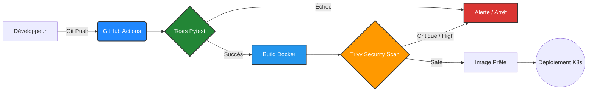
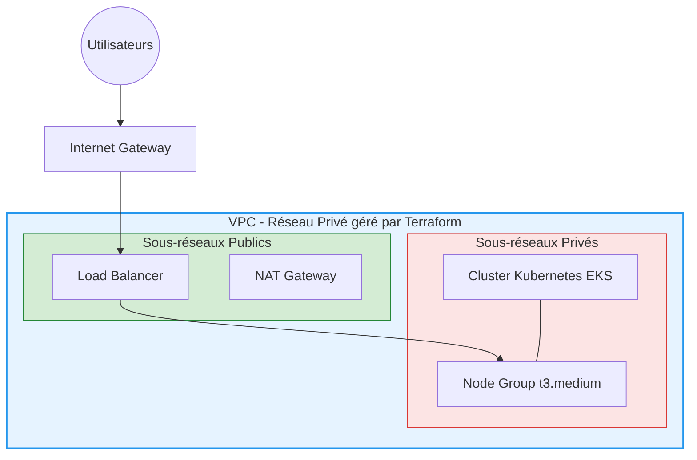

# 🚀 Enterprise DevSecOps & Cloud Pipeline


Ce projet est une démonstration complète d'une infrastructure "Zero-Touch" et "Production Ready", intégrant les meilleures pratiques d'industrialisation logicielle, de sécurité (DevSecOps) et de déploiement Cloud.

## 🎯 Compétences Démontrées

- **Qualité de code :** Tests unitaires automatisés via `pytest`.
- **Conteneurisation :** Application Python (FastAPI) packagée via `Docker`.
- **DevSecOps :** Scan de vulnérabilités automatisé (CVE) via `Trivy` directement dans le pipeline CI/CD.
- **Infrastructure as Code (IaC) :** Provisionnement complet du cloud AWS via `Terraform` (S3 Backend, VPC, NAT Gateway, EKS Cluster).
- **Orchestration :** Configuration de déploiement Kubernetes via des manifestes YAML (`Deployment`, `Service LoadBalancer`).

---

## 🏗️ Architecture Globale

### 1. Le Pipeline CI/CD (GitHub Actions)

À chaque `git push`, le pipeline exécute une série de vérifications strictes. Si une faille critique est détectée par Trivy, ou si un test échoue, le déploiement est immédiatement bloqué.



### 2. L'Infrastructure Cloud AWS (Terraform)

Le code IaC provisionne un réseau sécurisé et un cluster Elastic Kubernetes Service (EKS).



---

## 📂 Structure du Répertoire

```text
.
├── app/                        # Code source de l'application (FastAPI)
│   ├── main.py                 # Point d'entrée de l'API
│   ├── test_main.py            # Tests unitaires Pytest
│   └── requirements.txt        # Dépendances Python
├── k8s/                        # Manifestes Kubernetes
│   ├── deployment.yaml         # Configuration des pods (replicas)
│   └── service.yaml            # Exposition LoadBalancer
├── terraform/                  # Scripts Infrastructure as Code
│   ├── main.tf                 # Définition VPC, EKS, KMS, et Backend S3
│   └── variables.tf            # Variables cloud
├── .github/workflows/          
│   └── deploy.yml              # Pipeline CI/CD DevSecOps
└── Dockerfile                  # Instructions de build du conteneur
```

---

## 🚀 Lancer le projet localement

Vous n'avez pas besoin d'AWS pour tester l'application, tout peut tourner localement avec Docker !

**1. Construire l'image Docker :**
```bash
docker build -t devsecops-demo .
```

**2. Simuler le DevSecOps (Scanner l'image avec Trivy) :**
```bash
docker run --rm -v /var/run/docker.sock:/var/run/docker.sock aquasec/trivy image --severity CRITICAL,HIGH devsecops-demo:latest
```

**3. Lancer l'application :**
```bash
docker run -p 8080:8000 devsecops-demo
```
Accédez ensuite à l'API via `http://localhost:8080/`.

---

## ☁️ Déploiement Cloud (Terraform)

Si vous disposez d'un compte AWS et des identifiants (Access Keys) configurés, vous pouvez déployer (ou simuler le déploiement) de l'architecture.

*(Attention, le cluster EKS génère des coûts sur AWS. Utilisez `terraform destroy` après vos tests !)*

```bash
cd terraform
# Initialisation des modules EKS/VPC
terraform init

# Simulation des 51+ ressources à créer
terraform plan

# (Optionnel) Création réelle de l'infrastructure
terraform apply
```
